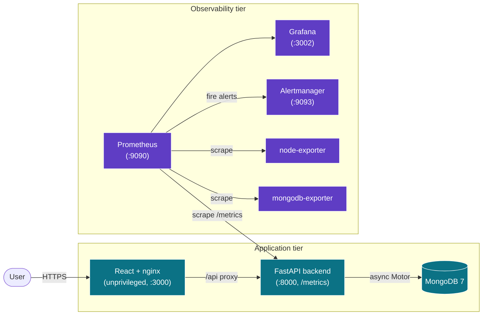

# DevOps Task Manager

> A production-grade, security-first full-stack platform demonstrating end-to-end DevOps practice: FastAPI + React + MongoDB, containerized with hardened Docker images, shipped through a multi-stage GitHub Actions pipeline with layered security scanning, and observed live through Prometheus + Grafana + Alertmanager.

[](https://github.com/BasitS-hash/dev-ops-stack/actions/workflows/ci.yml)
[](https://github.com/BasitS-hash/dev-ops-stack/actions/workflows/codeql.yml)
[](https://www.python.org/)
[](https://fastapi.tiangolo.com/)
[](https://react.dev/)
[](https://docs.docker.com/compose/)
[](#testing)
[](LICENSE)

**Built by [Basit Sherazi](https://linkedin.com/in/basitsherazi)** — designed, built, and shipped independently as a portfolio piece, not a tutorial follow-along.

---

## Why this project

Most "full-stack" portfolio repos stop at "it runs." This one is built the way a platform team ships software:

- **Security is the default, not an afterthought.** Rate limiting, strict CORS allowlists, security headers, request-size caps, non-root containers, secrets only via environment, and a CI pipeline that fails on real findings.
- **Everything is observable.** The backend exports Prometheus metrics; Prometheus scrapes the app, host, and database; Grafana visualizes it; Alertmanager routes alerts on downtime, error rate, latency, CPU, and memory.
- **The pipeline does the work.** Lint, test (with coverage gates), SAST, dependency CVE scanning, secret scanning, Dockerfile linting, and image scanning all run on every push.

---

## Architecture



Eight services orchestrated by Docker Compose on a single bridge network. All management ports bind to `127.0.0.1` only.

---

## Tech stack

| Layer | Technology |
|---|---|
| Backend API | Python 3.12 · FastAPI · Motor (async MongoDB) · slowapi |
| Frontend | React 18 · nginx (unprivileged) |
| Database | MongoDB 7 |
| Containerization | Docker (multi-stage, non-root) · Docker Compose |
| CI/CD | GitHub Actions (5 jobs) · Dependabot |
| Security scanning | Bandit · pip-audit · npm audit · Trivy (fs + image) · Gitleaks · Hadolint · CodeQL |
| Observability | Prometheus · Grafana · Alertmanager · node-exporter · mongodb-exporter |

---

## Features

- Task CRUD API with Pydantic input validation and a clean React UI (filters + live stats).
- Prometheus instrumentation: request rate, latency histogram, error counts, and `up` status.
- Alerting rules for backend down, MongoDB down, high 5xx rate, p95 latency, CPU, and memory.
- Defense-in-depth security posture (see [Security](#security)).
- Reproducible, hardened container images with healthchecks.
- 24 automated tests (20 backend + 4 frontend) with an 80% coverage gate.
- One-command local bring-up and an end-to-end smoke test.

---

## Observability

The backend exposes Prometheus metrics at `/metrics`:

| Metric | Type | Meaning |
|---|---|---|
| `http_requests_total{method,endpoint,status_code}` | counter | Total requests, labeled by matched route template |
| `http_request_duration_seconds{method,endpoint}` | histogram | Request latency distribution (for p95/p99) |
| `up{job="backend"}` | gauge | Scrape health of the backend |

**Grafana dashboard** (`monitoring/grafana/dashboards/app-dashboard.json`, auto-provisioned) shows:

- HTTP request rate by method + endpoint
- p95 request latency
- 5xx error rate
- Total request count
- Backend up/down status

**Alertmanager** routes alerts defined in `monitoring/prometheus/alert_rules.yml` — critical alerts (service down) repeat hourly, warnings every 12h. Slack and email receivers are stubbed and documented in `monitoring/alertmanager/alertmanager.yml`.

> _Screenshots placeholder — add Grafana dashboard captures here:_
> `docs/screenshots/grafana-overview.png`, `docs/screenshots/grafana-latency.png`

---

## Quick start

```bash
git clone https://github.com/BasitS-hash/dev-ops-stack.git
cd dev-ops-stack
cp .env.example .env          # set MONGO_PASSWORD and GRAFANA_PASSWORD
docker compose up --build
```

| Service | URL |
|---|---|
| Frontend | http://localhost:3000 |
| Backend API | http://localhost:8000 |
| API Docs (Swagger) | http://localhost:8000/docs |
| Metrics | http://localhost:8000/metrics |
| Prometheus | http://localhost:9090 |
| Grafana | http://localhost:3002 (login from `.env`) |
| Alertmanager | http://localhost:9093 |

Or use the Makefile: `make start`, `make logs`, `make clean`.

---

## Testing

```bash
# Backend (pytest + coverage gate)
cd backend && pip install -r requirements-dev.txt && pytest --cov=. --cov-report=term-missing

# Frontend (React Testing Library)
cd frontend && npm ci && CI=true npm test -- --watchAll=false

# Full end-to-end smoke test (requires Docker + .env)
set -a && source .env && set +a && ./scripts/smoke-test.sh
```

Backend coverage: **96%** (20 tests). Frontend: 4 component tests covering render, data, error, and create flows.

---

## CI/CD pipeline

Every push and PR to `main`/`develop` runs:

| Job | What it does |
|---|---|
| **backend** | Ruff lint + pytest with `--cov-fail-under=80` |
| **frontend** | ESLint + Jest + production build + `npm audit` (prod deps, fails on HIGH) |
| **security** | Bandit (SAST) · pip-audit (CVEs) · Gitleaks (secrets) · Hadolint (both Dockerfiles) · Trivy filesystem scan |
| **build** | Builds both images, then Trivy image-scans each (results → GitHub Security tab) |
| **CodeQL** | Separate workflow: Python + JS/TS, `security-extended`, weekly schedule |

Dependabot opens weekly PRs for pip, npm, Docker base images, and GitHub Actions.

---

## Security

This stack is hardened against the OWASP Top 10 and common container misconfigurations. See [SECURITY.md](SECURITY.md) for the full policy.

- **No committed secrets** — all credentials injected via environment (`.env`, gitignored); compose fails fast if required secrets are absent.
- **Strict CORS** — explicit `ALLOWED_ORIGINS` allowlist, never `*`; credentials disabled.
- **Rate limiting** — per-client limits via slowapi (`RATE_LIMIT`, default 100/min).
- **Security headers** — CSP, `X-Frame-Options: DENY`, `nosniff`, `Referrer-Policy`, `Permissions-Policy` on backend responses and the nginx layer.
- **Request-size caps** — oversized bodies rejected with `413` before being read.
- **Input validation** — Pydantic models with `extra="forbid"` and length bounds.
- **Hardened containers** — multi-stage, non-root users, pinned base images, `no-new-privileges`, read-only config mounts, healthchecks, log rotation.
- **Network exposure** — management ports bound to `127.0.0.1`; services communicate over an internal bridge.
- **Pinned, audited dependencies** — exact versions; pip-audit reports zero known CVEs.

---

## API endpoints

| Method | Path | Description |
|---|---|---|
| GET | `/health` | Health check + MongoDB status |
| GET | `/metrics` | Prometheus metrics |
| GET | `/api/tasks` | List all tasks |
| POST | `/api/tasks` | Create task `{"title": "..."}` |
| PUT | `/api/tasks/{id}` | Update task `{"completed": true}` |
| DELETE | `/api/tasks/{id}` | Delete task |

---

## Project structure

```
dev-ops-stack/
├── .github/
│   ├── workflows/ci.yml        # backend, frontend, security, build jobs
│   ├── workflows/codeql.yml    # SAST (python + js/ts)
│   └── dependabot.yml          # weekly dependency updates
├── backend/
│   ├── config.py               # env-validated, immutable settings
│   ├── main.py                 # FastAPI app: routes, metrics, hardening
│   ├── requirements*.txt
│   ├── Dockerfile              # multi-stage, non-root
│   └── tests/                  # pytest + mongomock-motor (96% cov)
├── frontend/
│   ├── src/                    # React app + tests
│   ├── nginx.conf              # reverse proxy + security headers
│   ├── package-lock.json       # reproducible builds
│   └── Dockerfile              # nginx-unprivileged, non-root
├── monitoring/
│   ├── prometheus/             # scrape config + alert rules
│   ├── alertmanager/           # alert routing
│   └── grafana/                # provisioned dashboards + datasource
├── scripts/smoke-test.sh       # end-to-end stack verification
├── docker-compose.yml          # 8-service hardened stack
└── Makefile                    # start / stop / test / lint / smoke
```

---

## Roadmap

- [ ] Pin Docker base images by `sha256` digest (currently patch-version tags)
- [ ] Add authentication (JWT) and per-user task ownership
- [ ] Backend OpenTelemetry traces alongside metrics
- [ ] Playwright E2E suite in CI
- [ ] Helm chart + Kubernetes manifests for cluster deployment
- [ ] SBOM generation (Syft) and image signing (Cosign)
- [ ] Blue/green deploy workflow with automated rollback

---

## License

[MIT](LICENSE) © Basit Sherazi
